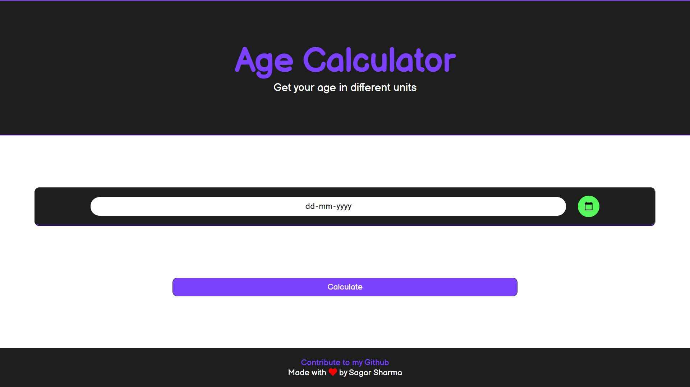

## Age In Days
## This is my new project. You can try the demo of age in days by click on the link below 
[Age In Days]()

<hr>
<br>

## Result
<p align="center">
  
  <br>
  
</p>

<hr>

## Text Editor Used


## Made With :-
<p float="left">

 
 
 

</p>


## Font used
```css
@import url('https://fonts.googleapis.com/css2?family=Langar&display=swap');

body{
    font-family: 'Langar', cursive;
}
```

## How to get Font Awesome
```html 
<link rel="stylesheet" href="https://cdnjs.cloudflare.com/ajax/libs/font-awesome/5.10.0/css/all.min.css" integrity="sha512-PgQMlq+nqFLV4ylk1gwUOgm6CtIIXkKwaIHp/PAIWHzig/lKZSEGKEysh0TCVbHJXCLN7WetD8TFecIky75ZfQ==" crossorigin="anonymous" />

 <i class="fab fa-github"></i><!-- for github icon -->
<i class="fas fa-heart" title="love"></i><!--  for heart icon -->

```

<hr>

## Cloning this repositary using command line
 1. Open **Git Bash**.
 1. Change the current working directory to the location where you want the cloned directory.
 1. Type `git clone https://github.com/Sagar-Sharma-7/Age-in-days.git`
 1. Press **Enter** to create the clone of this repositary.
 `


 ## How to reach me?
 [ ](mailto:6969sagarsharma@gmail.com)
 <hr>
 <br>

[](https://github.com/Sagar-Sharma-7)
 <hr>
 <p float="left">

[](https://github.com/Sagar-Sharma-7)
[ ](https://github.com/Sagar-Sharma-7)

</p>


[](https://github.com/Sagar-Sharma-7)


