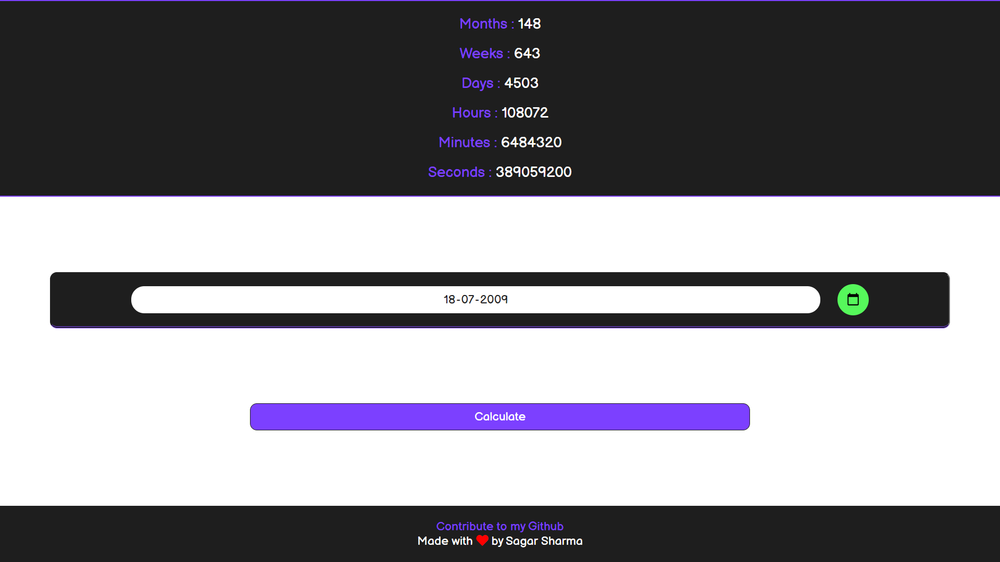

# Age Calculator
## Calculate your age in seconds, minutes, hours, days, weeks and months.
### Click on the link below to access the Age Calculate.
### [Age Calculate](https://sagar-sharma-7.github.io/Age-Calc)

-----
## Here are some screen shot of my Age Calculator
<p align="center">
  
  <br>
  
</p>

-----
## Editor used 


## Built with 
 
 
 
 
 
 

 -----
  ## Cloning this repositary using command line
 1. Open **Git Bash**.
 1. Change the current working directory to the location where you want the cloned directory.
 1. Type `git clone https://github.com/Sagar-Sharma-7/Age-Calc.git`
 1. Press **Enter** to create the clone of this repositary.
-----

## Font used 
```css 
@import url('https://fonts.googleapis.com/css2?family=Balsamiq+Sans&display=swap');
div{
    font-family: 'Nunito', sans-serif;
}

```

------
-----
## License  

### The scripts and documentation in this project are released under the MIT License 

-----

